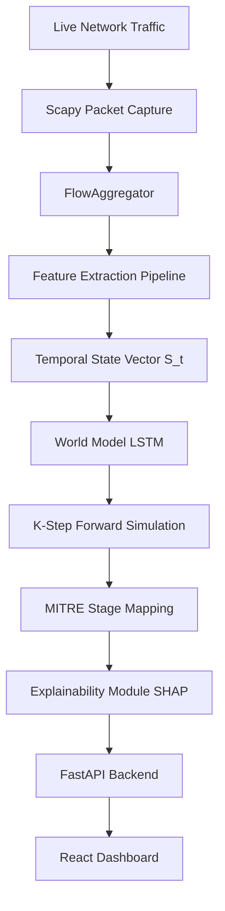

# 🛡️ AI Network Attack Forecasting System

An advanced proactive cyber defense framework that leverages **AI World Models** to learn network state transition dynamics and anticipate attacker progression before a compromise is completed.

## 🎯 What it Does
Traditional Intrusion Detection Systems (IDS) are **reactive**: they tell you an attack *is happening*. This system is **proactive**: it treats a network infiltration as a temporal sequence of events. By learning how a network's state evolves, it can forecast the next likely stage of an attack (e.g., predicting that a "Reconnaissance" phase is evolving into "Lateral Movement") and alert security analysts *before* the final objective is reached.

---

## 🔄 The Workflow (Data Pipeline)

The system operates as a continuous pipeline, transforming raw packets into strategic insights:

1.  **Packet Capture**: Raw network traffic is captured in real-time (using Scapy/Npcap).
2.  **Flow Aggregation**: Packets are grouped into bidirectional flows (sessions) using a `FlowAggregator`.
3.  **Feature Extraction**: Each flow is converted into a high-dimensional feature vector (e.g., packet counts, byte rates, flag ratios).
4.  **Temporal State Accumulation**: The system aggregates features over a fixed time window (e.g., 2 seconds) to create a **Temporal State Vector ($S_t$)**.
5.  **World Model Inference**: An **LSTM-based World Model** analyzes a sequence of these states to learn the transition probability $P(S_{t+1} \mid S_t)$.
6.  **K-Step Forecasting**: The model recursively predicts future states ($S_{t+1}, S_{t+2}, ... S_{t+k}$) to project the network's trajectory.
7.  **MITRE ATT&CK Mapping**: The predicted states are mapped to operational stages defined by the MITRE ATT&CK framework.
8.  **Dashboard Visualization**: The final risk score, predicted stage, and forecast charts are pushed to the Analyst Dashboard.

---

## 🧠 Models & Core AI Components

### 1. The World Model (LSTM)
The heart of the system is a **Long Short-Term Memory (LSTM)** neural network. Unlike a standard classifier, the World Model acts as a simulator of the network's behavior.
- **Input**: A sequence of temporal state vectors.
- **Output**: The predicted next state vector.
- **Capability**: It can perform "imagination" or **Recursive Rollouts**, predicting the network state several steps into the future without needing new real-time data.

### 2. MITRE ATT&CK Mapper
This component translates abstract AI state vectors into actionable security intelligence. It maps the model's output to the following progression:
`Reconnaissance` $\rightarrow$ `Initial Access` $\rightarrow$ `Lateral Movement` $\rightarrow$ `Command and Control` $\rightarrow$ `Exfiltration`

### 3. Explainability Engine (SHAP)
To avoid the "black box" problem, the system integrates **SHAP (SHapley Additive exPlanations)**. It identifies which specific network features (e.g., an increase in SYN-ACK ratios or unusual port diversity) are most responsible for a specific threat prediction.

---

## ✨ Key Features

### 🛠️ Pipeline Features
- **Real-time Capture**: High-performance packet sniffing on Windows/Linux/macOS.
- **API-based Simulation**: A dedicated injection endpoint (`/simulate-packet`) to test and verify the model without needing a live attack lab.
- **Temporal Windowing**: Dynamic accumulation of network behavior into discrete time windows.

### 🤖 AI & Analytics Features
- **K-Step Forecasting**: Anticipating attack progression multiple steps ahead.
- **Progression Tracking**: Tracking the movement of a threat through the MITRE ATT&CK lifecycle.
- **Feature Attribution**: Real-time "Why" analysis for every prediction.

### 💻 Analyst Dashboard
- **Live Threat Feed**: Real-time updates on the current predicted attack stage.
- **Forecast Charts**: Area charts showing the probability of threat escalation over the next $K$ windows.
- **Risk Heatmaps**: Visual indicators of current system vulnerability.

---

## 🏗️ Architecture

---

## 🚦 Getting Started

For a detailed, step-by-step guide on how to install dependencies, launch the servers, and run the simulation script, please refer to the **Start Manual**:

👉 **[start_manual.md](./start_manual.md)**

---

## 📂 Project Structure

- `backend/world_model.py`: Core LSTM transition model.
- `backend/forecast.py`: K-step recursive rollout engine.
- `backend/attack_progression.py`: MITRE ATT&CK mapping logic.
- `backend/explainability.py`: SHAP-based feature attribution.
- `backend/live_detector.py`: Live capture and pipeline orchestrator.
- `backend/fastapi/`: REST API implementation.
- `frontend/`: React dashboard.
- `backend/features.py`: Feature engineering pipeline.
- `simulate_traffic.py`: API-based traffic simulator for verification.
